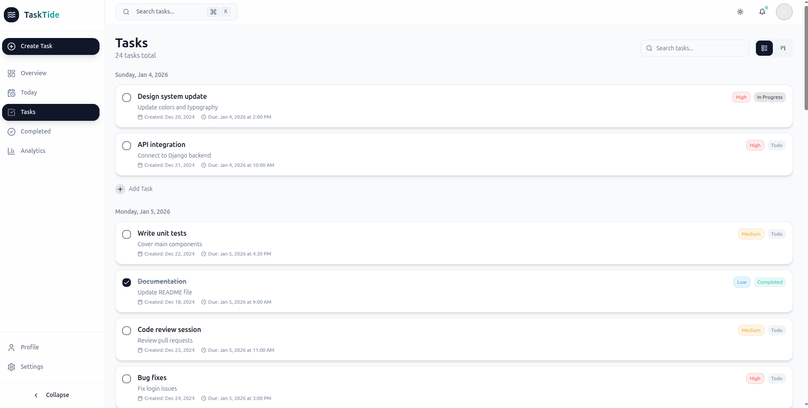

# Acta

<div align="center">
  
</div>

## 🌊 Introduction

Acta is a modern, beautifully designed task management application that brings simplicity and power together. Organize your workflow, track progress, and achieve more with our elegantly crafted task manager that rides the wave of productivity.

## ✨ Features

Acta offers a comprehensive set of features to help you manage your tasks and projects efficiently:

- **Smart Task Management**: Create, edit, and delete tasks with an intuitive interface
- **Progress Analytics**: Track your productivity with beautiful charts and insights  
- **Lightning Fast**: Optimistic updates for instant feedback on every action
- **Secure & Private**: Your data is encrypted and protected at all times
- **Beautiful Themes**: Light and dark mode with vibrant orange branding
- **Responsive Design**: Works seamlessly across desktop, tablet, and mobile devices
- **Modern UI Components**: Built with shadcn/ui for consistent, accessible design
- **Real-time Updates**: Stay synchronized across all your devices

## 🚀 Tech Stack

### Frontend
- **React 19.2.3** - Modern React with latest features
- **TypeScript** - Type-safe development
- **Vite** - Lightning-fast build tool
- **Tailwind CSS** - Utility-first styling
- **Framer Motion** - Smooth animations and transitions

### UI & Components
- **shadcn/ui** - Complete component library (49+ components)
- **Radix UI** - Accessible, unstyled UI primitives
- **Lucide React** - Beautiful icon library
- **React Hook Form + Zod** - Form handling and validation

### State Management & Data
- **Zustand** - Lightweight state management with persistence
- **TanStack React Query** - Powerful data fetching and caching
- **Axios** - HTTP client with JWT authentication

### Routing & Navigation
- **React Router DOM v7** - Client-side routing

### Development Tools
- **ESLint** - Code linting with TypeScript rules
- **PostCSS + Autoprefixer** - CSS processing
- **SWC** - Fast TypeScript/JavaScript compiler

## 🎨 Design System

Acta features a carefully crafted design system with:

- **Color Palette**: Vibrant orange primary colors with clean white/black backgrounds
- **Typography**: Inter font family for excellent readability
- **Glass Morphism**: Modern frosted glass effects
- **Responsive Grid**: Mobile-first design approach
- **Smooth Animations**: Delightful micro-interactions
- **Accessibility**: WCAG compliant components

## 📁 Project Structure

```
src/
├── components/
│   ├── ui/              # shadcn/ui components (49 components)
│   ├── layout/          # Navigation, footer, and layout components
│   ├── dashboard/       # Dashboard-specific components
│   ├── providers/       # Theme and context providers
│   └── settings/        # Settings and configuration components
├── hooks/               # Custom React hooks
├── lib/
│   ├── api-client.ts    # Axios setup with JWT auth
│   └── utils.ts         # Utility functions
├── pages/               # Page components
├── store/               # Zustand stores
└── assets/              # Images and static assets
```

## 🛠️ Getting Started

### Prerequisites
- Node.js 18+ 
- npm or yarn

### Installation

1. Clone the repository:
```bash
git clone <repository-url>
cd acta-frontend
```

2. Install dependencies:
```bash
npm install
```

3. Start the development server:
```bash
npm run dev
```

4. Open your browser and navigate to `http://localhost:8080`

### Available Scripts

- `npm run dev` - Start development server
- `npm run build` - Build for production
- `npm run preview` - Preview production build
- `npm run lint` - Run ESLint

## 🎯 Current Status

This is the frontend application for Acta, currently featuring:

- ✅ Complete UI component library setup
- ✅ Modern theme system (light/dark modes)
- ✅ Responsive landing page
- ✅ Authentication system integration ready
- ✅ API client with JWT support
- ✅ Production-ready build configuration

## 🔮 Upcoming Features

- Dashboard with task management
- User authentication flows
- Real-time collaboration
- Advanced analytics
- Mobile app companion
- API integration with Django backend

## 🤝 Contributing

We welcome contributions to Acta! Please feel free to submit issues, feature requests, or pull requests.

## 📄 License

This project is licensed under the MIT License - see the [LICENSE](LICENSE) file for details.

## 👨‍💻 Built By

**Oluwaseyi** - [GitHub](https://github.com/oluwaseyipd)

---

<div align="center">
  <strong>Acta - Ride the wave of productivity! 🌊</strong>
</div>
