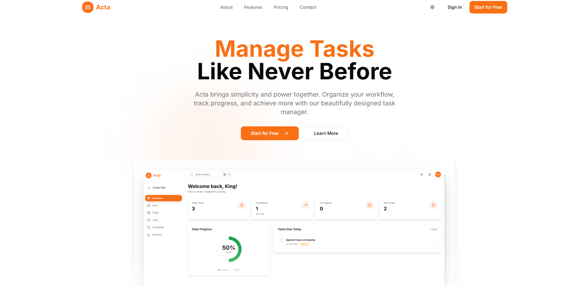

# Acta - Professional Task & Productivity Workspace (Frontend)

<div align="center">
  
</div>

<p align="center">
  <a href="https://actaly.vercel.app" target="_blank">
    
  </a>
  <a href="https://github.com/oluwaseyipd/acta-backend" target="_blank">
    
  </a>
</p>


<p align="center">
  
  
  
  
  
  
</p>

---

## Introduction

**Acta** is a premium, beautifully crafted client-side task and workspace management application. Designed with a modern, glassmorphic UI, it focuses on absolute responsiveness, client-side caching efficiency, and a seamless desktop-to-mobile layout. 

This repository houses the complete frontend source code, integrating with a Django REST framework API and Cloudflare R2 object storage.

---

## Core Architecture & Technical Highlights

Acta goes beyond a simple CRUD interface by implementing production-grade software engineering patterns:

### 1. Hybrid State Management Split
* **Server State & Caching**: Powered by **TanStack Query (React Query) v5**. It manages fetching, background synchronization, cache invalidation, and implements **optimistic UI updates** (e.g., checking off tasks immediately reflects in the UI before the network payload resolves, reverting gracefully on failure).
* **Local UI State**: Managed with **Zustand**. Handles lightweight, persistable states such as task views (list vs. Kanban board), user theme selections (Light, Dark, and Midnight presets), and sidebar collapse preferences.

### 2. Secure Token Rotation & SSO
* **JWT Interceptors**: Custom **Axios interceptors** automatically attach bearer tokens to API requests. 
* **Silent Token Refresh**: Intercepts `401 Unauthorized` responses, executes a token refresh call using the client-stored `refresh_token`, updates local storage, and retries the failed request seamlessly without user interruption.
* **Google OAuth2 SSO**: Integrated OAuth login flow utilizing secure redirect parameter parsing, with protective guards against authentication page reload loops.

### 3. Glassmorphic Responsive Layouts
* **Adaptive Navigation**: Built a custom, auto-collapsing sidebar. On desktop screens, it collapses down to a compact menu, swapping brand logo sizes seamlessly. On mobile viewports, it adapts into a sliding drawer modal complete with a transparent click-away handler.
* **Kanban Layout**: A column-based view organized by due-date logic (Today, Tomorrow, Inbox) rather than standard statuses. Fully responsive, pinning horizontal scrollbars to the bottom of the page container.

---

## Technology Stack

* **Core Framework**: React 19 (TypeScript) & Vite
* **Styling & Animations**: Tailwind CSS + custom glassmorphic classes & Framer Motion
* **UI Components**: shadcn/ui (Radix UI primitives) & Lucide icons
* **Forms & Validation**: React Hook Form + Zod validation schemas
* **Client Routing**: React Router DOM v7
* **Testing & Tools**: ESLint, PostCSS, and SWC compilers

---

## Project Structure

```text
src/
├── components/
│   ├── ui/              # Accessible shadcn/ui primitives
│   ├── layout/          # TopBar, SideBar, Footer, and layouts
│   ├── dashboard/       # Specialized views (Kanban cards, modals)
│   └── providers/       # Theme and tool context providers
├── hooks/               # Custom lifecycle hooks (sound controllers, viewport hooks)
├── lib/
│   ├── api-client.ts    # Axios instance with request/response interceptors
│   └── utils.ts         # Utility helpers (class merger)
├── pages/               # Layout pages (Overview, Inbox, Profile, Analytics)
├── store/               # Zustand stores
└── types/               # TypeScript data interfaces
```

---

## Getting Started

### Prerequisites
* Node.js 18+
* npm or yarn

### Installation & Local Setup

1. **Clone the repository:**
   ```bash
   git clone https://github.com/oluwaseyipd/acta-frontend.git
   cd acta-frontend
   ```

2. **Install dependencies:**
   ```bash
   npm install
   ```

3. **Configure Environment Variables:**
   Create a `.env` file in the project root:
   ```ini
   VITE_API_BASE_URL=https://your-api-domain.com/api/v1
   # EmailJS Config (optional)
   VITE_EMAILJS_SERVICE_ID=your_service_id
   VITE_EMAILJS_TEMPLATE_ID=your_template_id
   VITE_EMAILJS_PUBLIC_KEY=your_public_key
   ```

4. **Start the development server:**
   ```bash
   npm run dev
   ```
   Open `http://localhost:3000` (or the local fallback port) in your browser.

---

## Available Scripts

* `npm run dev` - Start local Vite dev server
* `npm run build` - Compile and optimize assets for production
* `npm run preview` - Locally preview the compiled production build
* `npm run lint` - Run ESLint checking for code style issues

---

## License

Distributed under the MIT License. See [LICENSE](LICENSE) for details.

## Support

Kindly leave a star ⭐ if you find this project useful. Thanks!💖
